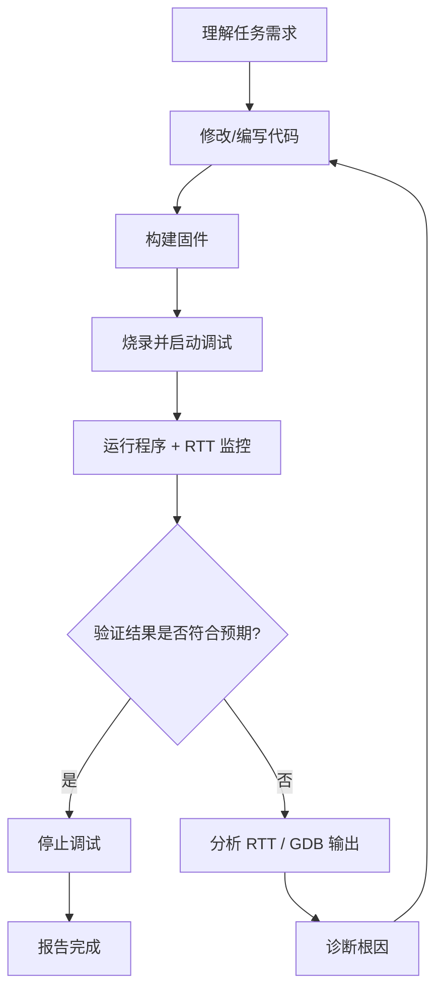

# openocd-mcp Embedded Debug Skill

## 项目概述

openocd-mcp 是一个基于 fastmcp 的 MCP 服务器，将 OpenOCD 烧录与 GDB 调试工作流封装为 AI 可调用的工具。它复用项目已有的 `.vscode/launch.json` 作为调试目标来源，无需额外配置。

| 属性 | 说明 |
|------|------|
| 仓库 | `D:\GitHub_Repository\openocd-mcp` |
| 安装方式 | `uv tool install .` 或 `uv tool install git+https://github.com/luiox/openocd-mcp.git` |
| 运行模式 | stdio（默认，VS Code MCP）/ SSE（`--sse --host 127.0.0.1 --port 9000`） |
| 通信协议 | GDB/MI2 异步协议（`--interpreter=mi2`），事件驱动，无需轮询 |
| 后端依赖 | OpenOCD + arm-none-eabi-gdb |
| 平台支持 | Windows / Linux / macOS |

## 核心架构

```
AI 客户端 → MCP 协议 → openocd-mcp
                           ├── ProjectConfigManager (解析 launch.json)
                           ├── OpenOCDController (启动/停止 OpenOCD 进程)
                           ├── GDBMISession (MI2 异步协议通信)
                           ├── RTTClient (实时日志读取)
                           └── DebugSessionManager (协调生命周期)
```

## MCP 工具完整参考

所有工具默认返回字符串，失败时以 `"Error: "` 开头。

### 项目与配置

| 工具 | 描述 | 典型用法 |
|------|------|----------|
| `set_project(project_dir)` | 加载项目 `.vscode/launch.json` | `set_project(project_dir="d:/path/to/project")` |
| `refresh_debug_targets()` | 重新加载 launch.json 配置 | 修改 launch.json 后刷新 |
| `get_runtime_config()` | 查看当前 OpenOCD/GDB 路径及其来源 | 排查路径问题时使用 |

### 烧录与调试生命周期

| 工具 | 描述 | 典型用法 |
|------|------|----------|
| `flash_download(config_name, firmware_path?)` | 一次性烧录固件（不启动调试） | `flash_download(config_name="Launch (DAP)")` |
| `debug_start(config_name, firmware_path?)` | 启动调试会话 | `debug_start(config_name="Launch (DAP)")` |
| `debug_stop()` | 停止调试会话 | `debug_stop()` |

### 运行时控制

| 工具 | 描述 | 关键说明 |
|------|------|----------|
| `debug_continue()` | 恢复目标运行 | **异步返回**，不阻塞。目标运行期间 GDB 仍可响应其他命令 |
| `debug_interrupt()` | 暂停目标 | 通过 GDB/MI `-exec-interrupt` 中断。Windows 自动 fallback 到 OpenOCD telnet halt |
| `debug_command(command)` | 执行任意 GDB 命令 | `"continue"`/`"interrupt"`会自动映射为 MI 异步命令 |
| `debug_state()` | 查询目标状态 | 返回 `{"state": "running"|"stopped", "reason": "..."}` |
| `debug_status()` | 获取完整会话信息 | 含 PID、RTT 连接状态等 |

### 数据读取

| 工具 | 描述 | 典型用法 |
|------|------|----------|
| `read_rtt(max_lines=10)` | 读取 RTT 实时日志 | `read_rtt(max_lines=20)` |
| `debug_command(command)` | 读取寄存器/变量 | `debug_command("info registers")` / `debug_command("print x")` |

### 服务器控制

| 工具 | 描述 | 典型用法 |
|------|------|----------|
| `shutdown()` | 优雅退出 MCP 服务器 | 重新安装前调用以释放文件锁 |

---
> ⚠️ **强制工作流**：当你被要求添加功能、修复 bug、或监控运行时，必须按照下面的"开发验证闭环"执行，不得跳过验证步骤直接报告完成。
---

## 开发验证闭环（Mandatory Develop-Verify Loop）

这是本 skill 的**核心工作流**。无论任务类型（新功能、修 bug、调试分析），都必须遵循此闭环。

### 闭环总览



### 分步说明

#### 第 1 步：理解需求与计划
- 明确要修改的代码文件（驱动/HAL/应用层）
- 确认验证标准：RTT 中应该出现什么日志？行为应该怎样变化？

#### 第 2 步：修改代码
- 按需求修改源文件
- 记录改动点，以便后续验证时对照

#### 第 3 步：构建固件 🔨
```bash
xmake f -p cross -a arm -m debug
xmake build weather_station
```
- 构建成功才能进入下一步
- 构建失败 → 修复编译错误 → 重新构建

#### 第 4 步：烧录并启动调试 🚀
```
set_project(project_dir="d:/GitHub_Repository/weather-station")
debug_start(config_name="Launch weather_station (DAP)")
```
- 确认输出包含 `RTT connected on port 8888`
- 确认输出包含 `Stopped at main (breakpoint hit)`

#### 第 5 步：运行 + RTT 验证 📡
```
debug_continue()
# 等待足够时间让代码逻辑执行（视场景：2秒/10秒/20秒）
debug_interrupt()
read_rtt(max_lines=20)
```

#### 第 6 步：分析验证结果 🔍
- **RTT 日志中出现预期行为** → 验证通过 → 停止调试 → 报告完成
- **RTT 日志异常或无输出** → 分析根因：
  - 代码逻辑错误 → 回到第 2 步
  - 构建问题 → 回到第 3 步
  - 调试问题 → 检查 GDB/RTT 状态

#### 第 7 步：报告完成
- 汇总：改了哪些文件、验证了什么、RTT 核心输出
- 确认任务所有要求点都已满足

### 四种典型任务的验证标准

| 任务类型 | 核心验证方法 | 预期 RTT 输出示例 |
|----------|-------------|-------------------|
| **新功能**（如新增传感器驱动） | 观察 RTT 是否出现新传感器的数据日志 | `[INFO] ACQ: ... NEW_SENSOR=123 ...` |
| **修复 Bug** | 确认 bug 对应错误消失，正常日志出现 | 原 `[ERROR] xxx failed` 消失，`[INFO] xxx OK` 出现 |
| **修改逻辑**（如调整采集周期） | 验证 RTT 日志间隔/行为符合新逻辑 | 日志从每 2 秒变为每 5 秒一次等 |
| **监控运行**（如分析稳定性） | 长时间运行后检查 RTT 是否有异常 | 连续 30 条以上 `ACQ` 记录无错误 |

### 完整流程示例：新增功能后自主验证

```
用户: "给 weather-station 添加一个风速传感器报警功能"

Agent 执行闭环:

① 理解需求 → 需要在 anemometer 驱动中加阈值报警
② 修改代码 → 修改 src/driver/anemometer.c
③ 构建      → xmake build weather_station  (成功)
④ 烧录调试  → set_project + debug_start
⑤ 运行验证  → debug_continue → 等10秒 → debug_interrupt → read_rtt
⑥ 分析      → RTT 中出现了 "⚠️ Wind speed exceeded: 18.5m/s"
               → 符合预期 ✅
⑦ 报告完成  → 汇总改动和验证结果

如果 RTT 中没有报警信息 → 回到②修复逻辑 → ③~⑥ 重新验证
```

### 完整流程示例：修复 Bug 后自主验证

```
用户: "LoRa 发送一直失败，帮我查一下"

Agent 执行闭环:

① 理解需求 → LoRa 发送返回错误，需要排查
② 定位代码 → 发现 lora_port.c 中发送超时处理有问题
③ 修改代码 → 修复超时重试逻辑
④ 构建      → 成功
⑤ 烧录验证  → debug_continue → 等 10 秒 → read_rtt
⑥ 分析      → RTT 出现 "[INFO] LoRa send OK (46B)"
               → 之前是 "[ERROR] LoRa send failed"
               → Bug 已修复 ✅
⑦ 报告完成  → 说明根因和修改

如果仍然出现失败 → 继续分析驱动代码 → 修正 → 重新烧录验证
```

### RTT 输出解读速查

| RTT 日志模式 | 含义 |
|-------------|------|
| `[INFO] ACQ: T=.. H=.. P=..` | 正常数据采集（每 ~2 秒） |
| `[ERROR] ... failed` | 传感器或通信失败，需排查 |
| `[INFO] System ready` | 系统初始化完成 |
| `[INFO] LoRa send OK` | LoRa 发送成功 |
| 无 RTT 输出 | 检查 RTT 连接；或固件未到达日志输出点 |
| `rtt: Control block not available` | RTT 控制块未初始化（`log_init()` 未调用） |

## RTT 日志详解

RTT 通过自动启动流程工作：

```
debug_start → GDB monitor rtt server start 8888 0
            → GDB print &_SEGGER_RTT (获取控制块地址)
            → GDB monitor rtt setup <地址> 1024
            → GDB monitor rtt start
            → TCP 连接 127.0.0.1:8888 ← RTTClient
```

**要点：**
- 固件必须已包含 SEGGER RTT 实现（`SEGGER_RTT_Conf.h`、`SEGGER_RTT.c`）
- RTT 初始化发生在 `log_init()` 之后，`rtt setup` 预置地址但不阻塞
- RTT 失败**不阻塞**调试会话，静默降级
- 通过 `debug_status()` 的 `rtt_connected` 字段判断 RTT 是否正常
- 默认端口 8888，可通过 `--rtt-port` / `RTT_PORT` 环境变量 / `config.json` 的 `rtt_port` 字段更改

## 配置方式

参数优先级：**CLI 参数 > 环境变量 > config.json > 内置默认值**

### config.json（工作区根目录）

```json
{
  "openocd_path": "C:/Program Files (x86)/xpack-openocd-.../bin/openocd.exe",
  "gdb_path": "C:/Program Files (x86)/Arm GNU Toolchain/.../bin/arm-none-eabi-gdb.exe",
  "openocd_scripts": "",
  "rtt_port": 8888,
  "adapter_speed": 1000
}
```

### 环境变量

| 变量 | 用途 |
|------|------|
| `OPENOCD_PATH` | OpenOCD 可执行文件路径 |
| `GDB_PATH` | GDB 可执行文件路径 |
| `OPENOCD_SCRIPTS` | OpenOCD 脚本目录 (`-s` 参数) |
| `RTT_PORT` | RTT 服务器端口 |

### CLI 参数

```bash
openocd-mcp --openocd-path openocd --gdb-path arm-none-eabi-gdb --rtt-port 8888
openocd-mcp -sse --host 127.0.0.1 --port 9000  # SSE/HTTP 模式
```

### VS Code MCP 配置（.vscode/mcp.json）

```json
{
  "servers": {
    "openocd-mcp": {
      "type": "stdio",
      "command": "openocd-mcp",
      "args": [],
      "cwd": "${workspaceFolder}"
    }
  }
}
```

## 平台差异

### Windows
- **中断机制**：GDB/MI `-exec-interrupt` 管道中断不可靠，自动 fallback 到 **OpenOCD telnet halt**（连接 127.0.0.1:4444 发送 `halt\n`）
- **路径**：OpenOCD 要求 forward slash，代码已自动处理
- **进程管理**：GDB 启动时使用 `CREATE_NEW_PROCESS_GROUP` 标志

### Unix (Linux/macOS)
- **中断机制**：GDB/MI `-exec-interrupt` 直接可靠
- 优先 MI 方式，telnet fallback 为降级选项

## MCP 工具无法调用（"disabled by the user"）的解决方案

如果出现 `ERROR while calling tool: Tool mcp_openocd-mcp_xxx is currently disabled by the user`：

```bash
# 1. 清理 MCP 缓存并预批准工具
python -c "
import sqlite3, json
ws = sqlite3.connect('C:/Users/xxx/AppData/Roaming/Code/User/workspaceStorage/<workspace_id>/state.vscdb')
for key in ['mcpToolCache', 'mcp.extCachedServers']:
    ws.execute('DELETE FROM ItemTable WHERE key = ?', (key,))
tools = ['set_project','refresh_debug_targets','flash_download','debug_start','debug_stop',
         'debug_command','debug_continue','debug_interrupt','debug_status','debug_state',
         'get_runtime_config','read_rtt','shutdown']
autoconfirm = {f'mcp_openocd-mcp_{t}': True for t in tools}
ws.execute('INSERT OR REPLACE INTO ItemTable (key, value) VALUES (?, ?)',
           ('chat/autoconfirm', json.dumps(autoconfirm)))
ws.commit(); ws.close()
"
# 2. 重载 VS Code 窗口（Ctrl+Shift+P → Developer: Reload Window）
```

## 常见问题排查

### 1. OpenOCD 启动失败
```
Error: OpenOCD failed to start: [WinError 2] 系统找不到指定的文件。
```
- **原因**：`config.json` 中的 `openocd_path` 路径不存在或读错了配置文件
- **排查**：调用 `get_runtime_config()` 查看实际读取的路径和来源
- **修复**：确保工作区根目录下的 `config.json` 包含正确的路径

### 2. GDB 连接失败
```
Error: GDB connection failed: Remote communication error.
```
- **原因**：OpenOCD 未能在 15 秒内启动 GDB 服务器（端口 3333）
- **排查**：检查调试器物理连接；检查 OpenOCD 脚本是否正确；降低 `adapter_speed`
- **修复**：在 `config.json` 中添加 `"adapter_speed": 500`

### 3. Flash 烧录失败
```
Error erasing flash with vFlashErase packet
```
- **原因**：SWD 时钟速度过高，通信不稳定
- **修复**：降低 `adapter_speed`（常见稳定值：1000kHz、500kHz）

### 4. RTT 无数据
```
RTT: (no new RTT output)
```
- **原因**：固件未包含 SEGGER RTT，或 `log_init()` 未调用
- **排查**：`debug_status()` 中检查 `rtt_connected` 是否为 `true`
- **修复**：确认固件已集成 SEGGER RTT 库并在启动时调用 `log_init()`

### 5. debug_interrupt 超时
```
Error: GDB command timed out after 30s: -exec-interrupt
```
- **原因**：Windows 上 GDB 管道信号不可靠
- **诊断**：OpenOCD telnet halt 已作为自动 fallback，不应出现。如果仍然超时，手动通过 telnet 检查：
  ```bash
  python -c "import socket;s=socket.socket();s.settimeout(3);s.connect(('127.0.0.1',4444));s.sendall(b'halt\n');s.close()"
  ```

### 6. 重新安装时报文件锁错误
```
error: failed to remove directory ... Scripts: 拒绝访问
```
- **原因**：旧 MCP 进程仍在运行，持有文件锁
- **修复**：先调用 `shutdown()` 停止当前 MCP 进程，或手动 `taskkill //F //IM openocd-mcp.exe`

## 重新安装 MCP 的标准流程

```bash
# 1. 让当前 MCP 进程退出
# 在 AI 对话中调用 shutdown()

# 2. 确保进程已终止（可选）
taskkill //F //IM openocd-mcp.exe

# 3. 更新代码并重新安装
cd D:/GitHub_Repository/openocd-mcp
git pull  # 或修改代码后
uv tool install --reinstall .

# 4. 重载 VS Code 窗口
# Ctrl+Shift+P → Developer: Reload Window
```

## 注意事項

1. **单会话模型**：同时最多一个调试会话，`debug_start` 会自动停止之前的会话
2. **launch.json 兼容性**：支持带 C 风格注释和尾随逗号的 JSON（解析器自动清理）
3. **超时控制**：普通 GDB 命令 30 秒超时，`load` 120 秒，flash 180 秒
4. **路径解析**：`${workspaceRoot}` 和 `${workspaceFolder}` 自动替换为项目目录
5. **config.json 读取**：基于 CWD（当前工作目录），读取 `CWD/config.json`
6. **异步继续**：`debug_continue()` 通过 MI `^running` 立即返回，不阻塞等待目标停止

---

## 工作流强制性提醒

> ⚠️ **每次修改代码后，必须经过"构建 → 烧录 → RTT 验证"环节才能报告完成。**
>
> ⚠️ **验证不通过时，必须分析 RTT 输出、诊断根因、修复代码、重新验证，形成闭环。**
>
> ⚠️ **不得因为"看起来修好了"就跳过验证步骤。RTT 日志是判断任务完成的唯一依据。**
