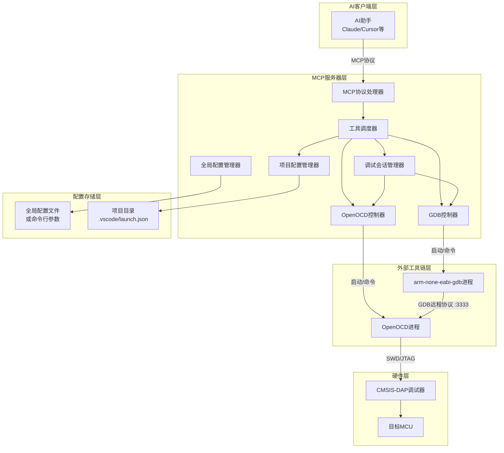

## openocd-mcp 架构设计

openocd-mcp 是一个 MCP 服务器，它允许 AI 客户端通过自然语言调用嵌入式烧录与调试功能。其核心设计理念是 **完全复用开发者已有的 VS Code 调试配置（launch.json）**，让 AI 能够像开发者一样理解项目中的调试目标，并以最少的参数完成烧录与调试操作。

---

### 1. 整体架构

---

### 2. 模块说明

#### 2.1 MCP协议处理器
- **职责**：实现 MCP 服务器的核心通信协议，接收 AI 客户端的 JSON-RPC 请求，解析工具调用，并将结果返回给客户端。
- **实现**：使用 Python 的 `fastmcp` 库简单实现，注册所有工具（`set_project`, `refresh_debug_targets`, `flash_download` 等）。

#### 2.2 工具调度器
- **职责**：根据工具名称调用对应的处理函数，并协调各管理器完成操作。
- **关键逻辑**：
  - 对于 `set_project` 和 `refresh_debug_targets`，调用项目配置管理器。
  - 对于 `flash_download`，调用 OpenOCD 控制器执行一次性烧录。
  - 对于 `debug_start`，先停止当前会话（如果有），然后调用调试会话管理器启动新会话。
  - 对于 `debug_command`、`debug_stop`、`debug_status`，调用调试会话管理器或对应控制器。
- **错误处理**：所有调用均包装在 try-except 中，返回以 `"Error: "` 开头的友好错误信息。

#### 2.3 全局配置管理器
- **职责**：管理服务器启动时传入的全局配置（OpenOCD 路径、GDB 路径等）。
- **数据来源**：命令行参数（如 `--openocd-path`）或环境变量。可扩展支持从 `~/.openocd-mcp/config.json` 读取默认值。
- **提供接口**：`get_openocd_path()`, `get_gdb_path()` 等。

#### 2.4 项目配置管理器
- **职责**：
  - 根据 `set_project` 传入的项目目录，读取并解析 `.vscode/launch.json`。
  - 替换路径变量（如 `${workspaceRoot}` 为项目目录），将相对路径转换为绝对路径。
  - 缓存解析后的配置列表（以 `name` 为键），并提供 `refresh()` 方法重新加载。
  - 提供 `get_config(name)` 返回指定配置的详细信息。
- **关键点**：`launch.json` 可能包含多个配置，每个配置的 `name` 字段是唯一标识。缓存中存储的配置对象应包含：`executable`（绝对路径）、`configFiles`（列表）、`runToEntryPoint`（可选）、`cwd`（可选）等字段。

#### 2.5 调试会话管理器
- **职责**：管理当前的调试会话（最多一个）。提供以下功能：
  - `start_session(config_name, firmware_path_override)`：启动 OpenOCD 和 GDB，保存进程对象。
  - `stop_session()`：终止所有子进程，清理状态。
  - `get_status()`：返回当前会话状态（是否活跃、使用的配置、进程 PID 等）。
  - `ensure_session()`：检查会话是否存在，否则抛出异常（供 `debug_command` 等使用）。
- **状态存储**：全局变量 `_current_session`，包含：
  - `config_name`
  - `firmware_path`
  - `openocd_process` (subprocess.Popen 或 asyncio.Process)
  - `gdb_process`
  - `openocd_port`（通常固定 3333）

#### 2.6 OpenOCD控制器
- **职责**：封装对 OpenOCD 的所有操作。
  - **一次性烧录**：`flash(config_files, firmware_path, firmware_type, address)`，启动一个短暂进程执行 `program` 命令，返回输出。
  - **启动 GDB 服务器**：`start_server(config_files)`，启动常驻 OpenOCD 进程，并返回进程对象。
  - **停止服务器**：终止进程。
- **实现细节**：
  - 使用 `subprocess.Popen` 或 `asyncio.create_subprocess_exec` 管理进程。
  - 对于一次性烧录，需等待进程结束并捕获 stdout/stderr。
  - 路径处理：OpenOCD 的工作目录设置为项目目录，以便相对脚本路径能正确解析。

#### 2.7 GDB控制器
- **职责**：封装对 GDB 的交互。
  - **启动**：`start(firmware_path)`，启动 GDB 进程，并立即发送 `target remote :3333` 和 `load` 命令。
  - **执行命令**：`send_command(cmd)`，向 GDB 进程发送命令，等待提示符 `(gdb)` 出现，收集输出后返回。
  - **停止**：终止进程。
- **实现要点**：
  - 使用管道与 GDB 交互（stdin/stdout），需要可靠地解析输出。可以基于 `asyncio` 流式读取，或使用 `pexpect` 简化。
  - 命令发送后，需读取直到下一个 `(gdb)` 提示符，但注意多行输出可能包含 `(gdb)` 字样，需智能判断。
  - 处理 GDB 的 `(gdb)` 提示符出现前的所有输出，返回时去除提示符行。

#### 2.8 MVP阶段特性边界
- 当前 MVP 阶段不包含 RTT 客户端与日志读取能力。
- RTT 相关设计已迁移到独立文档：`RTT特性.md`。

---

### 3. 数据流示例

场景：用户说“我在 /home/user/project 下，调试 mbootloader”

1. **AI 调用 `set_project`**
   - 工具调度器 → 项目配置管理器：读取 `/home/user/project/.vscode/launch.json`，解析所有配置。
   - 返回可用配置列表给 AI。

2. **AI 调用 `debug_start` 传入 `config_name="Debug mbootloader"`**
   - 工具调度器 → 调试会话管理器：检查是否有活跃会话，如有则停止。
   - 调试会话管理器 → 项目配置管理器：获取配置详情。
  - 调试会话管理器 → OpenOCD控制器：启动 OpenOCD 服务器（使用配置中的 `configFiles`）。
   - 调试会话管理器 → GDB控制器：启动 GDB，加载固件，自动连接并运行到入口（若配置中有 `runToEntryPoint`）。
   - 保存会话状态，返回成功信息给 AI。

3. **用户继续提问“打印变量 x”**
   - AI 调用 `debug_command` 传入 `command="print x"`。
   - 工具调度器 → 调试会话管理器：确保会话活跃。
   - 调试会话管理器 → GDB控制器：发送命令，解析输出，返回结果给 AI。

4. **用户完成调试**
   - AI 调用 `debug_stop`。
   - 工具调度器 → 调试会话管理器：终止所有进程，关闭连接，清理状态。

---

### 4. 关键设计要点

- **完全复用 `launch.json`**：所有调试目标信息来源于此，无需额外配置。开发者只需维护熟悉的 VS Code 调试配置。
- **极简 AI 接口**：AI 只需知道项目目录和配置名称，即可执行核心操作（烧录、调试、命令）。参数数量最小化。
- **单会话模型**：一次只支持一个活跃调试会话，简化状态管理。未来可扩展为多会话，但当前设计已预留接口（调试会话管理器可轻松改为字典）。
- **清晰的错误返回**：所有工具返回字符串，失败时以 `"Error: "` 开头，便于 AI 理解并采取纠正措施。
- **模块化设计**：各管理器职责单一，易于测试和替换（例如，未来可添加 PyOCD 控制器，只需替换 OpenOCD 控制器而无需修改上层）。
- **变量替换与路径解析**：`launch.json` 中的 `${workspaceRoot}` 等变量被自动替换为实际项目目录，确保固件路径正确；OpenOCD 脚本的相对路径基于项目目录解析。

---

### 5. 与 VS Code 工作流的无缝集成

- 开发者已经在 VS Code 中通过 `launch.json` 配置了多个调试目标。
- 使用 openocd-mcp 时，无需修改任何现有文件。
- AI 通过 `set_project` 得知项目目录后，自动识别所有配置，并可按照配置名称操作。
- 开发者可以在 VS Code 和 AI 助手之间自由切换，配置完全一致。

---

### 6. 总结

openocd-mcp 的架构围绕 **复用现有配置** 和 **极简 AI 接口** 展开，通过明确的模块划分和清晰的职责，实现了一个可靠、可扩展的 MCP 服务器。开发者无需额外学习，AI 只需掌握两个核心信息（项目目录和配置名称），即可完成嵌入式开发中的核心烧录与调试操作。